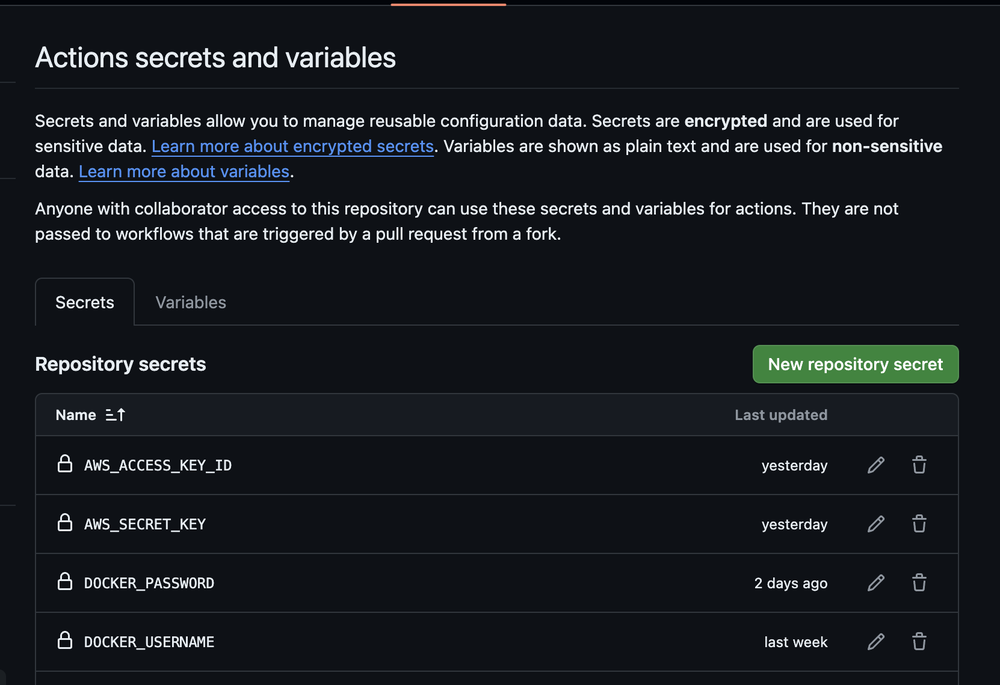
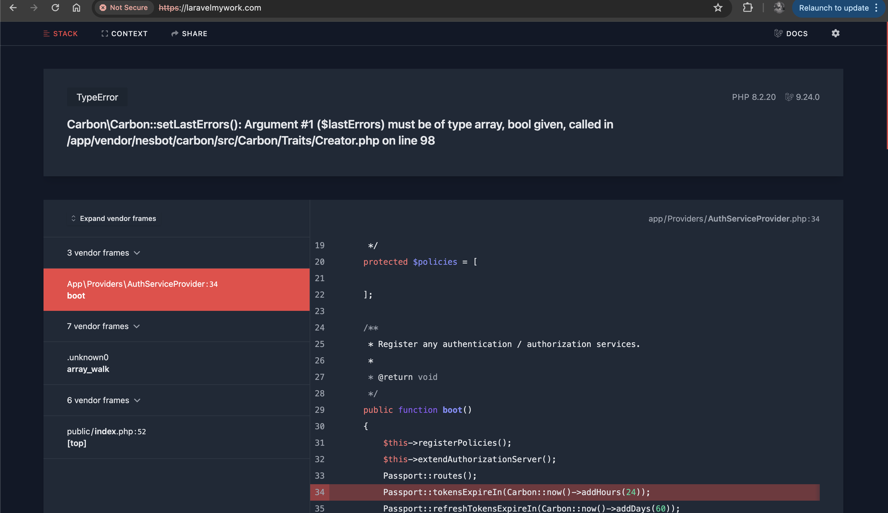
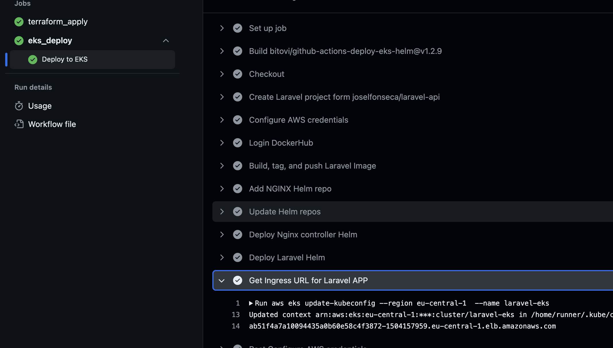
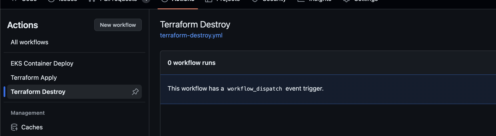

# Laravel Application

Welcome to the Laravel Application repository! This projecat serves as a demonstration of deploying a Laravel application on AWS EKS using Terraform. It includes an Nginx web server and Laravel app as sidecar container

## Getting Started

Follow the steps below to set up and deploy the Laravel application:

**IAM user: Root user since it is demo project and including lots of stack**

normally should use spesific IAM user with role, policy and group assigments

### Prerequisites

Ensure you have the following prerequisites installed on your local machine:

* [AWS CLI](https://aws.amazon.com/cli/)
* [Terraform](https://www.terraform.io/downloads.html)
* [Docker](https://www.docker.com/products/docker-desktop)
* *AWS root user access key is used for demo purposes, but for production, IAM user and role policies are required*
* [Helm]()
* [Kubectl]()
* [VSCode](https://code.visualstudio.com/)
* Docker buildx
* Docker compose
* dockerhub account needed for image pull secret.

* ### Clone the Repository

Clone this repository to your local machine using the following command:

```bash
git clone https://github.com/Suleymanklc/laravel-app.git
cd laravel-app
```

* ### Local run

```
docker build -t laravel:latest . -f Dockerfile
docker tag laravel:latest pisko0808/laravel:latest
docker push pisko0808/laravel:latest
```

``docker-compose up -d -f docker-compose.yml``

* ### Terraform backend s3 and modules

Due to demo infrastructure there is no dynamo for lock managment

```
 backend "s3" {
    bucket = "statebucketfordemo"
    key    = "statetf"
    region = "eu-central-1"
  }
```

Since it is demo application all resources were not be modularised and approcahed keept simple

* ### Github workflows

.github folder includes workflows both helm and terraform infrastructure

**prerequirements:**



* ### Chart folder

Includes laravel applications and default yaml included all values since there are different no envrinments, default yaml is used.

###### Important

***laravel application is running with Nginx server as sidecar since laravel is not exposing 9000 as http and requires additional web sever. Although php artisan can serves too nginx is better approach for production**

please check: chart/templates/deployment.yaml

##### Set laravelmywork.com with load balancer public IP as below within your local etc/hosts

**domain name : laravelmywork.com(ingress domain))**

**ip will be publised at the results of below run**



grab LB adress of the controller from the action step



##### Destroy terraform resources after review is done by manually triggering relevant action


