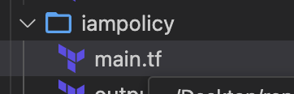

# Laravel Application

Welcome to the Laravel Application repository! This projecat serves as a demonstration of deploying a Laravel application on AWS EKS using Terraform. It includes an Nginx web server and Laravel app as sidecar container

## Getting Started

Follow the steps below to set up and deploy the Laravel application:

### Prerequisites

Ensure you have the following prerequisites installed on your local machine:

* [AWS CLI](https://aws.amazon.com/cli/)
* [Terraform](https://www.terraform.io/downloads.html)
* [Docker](https://www.docker.com/products/docker-desktop)
* *AWS root user access key is used for demo purposes, but for production, IAM user and role policies are required*
* [Helm]()
* [Kubectl]()
* [VSCode](https://code.visualstudio.com/)
* Docker buildx
* Docker compose

* ### Clone the Repository

Clone this repository to your local machine using the following command:

```bash
git clone https://github.com/Suleymanklc/laravel-app.git
cd laravel-app
```

* ### Local run

```
docker build -t laravel:latest . -f Dockerfile
docker tag laravel:latest pisko0808/laravel:latest
docker push pisko0808/laravel:latest
```

``docker-compose up -d -f docker-compose.yml``

* ### Terraform backend s3 and modules

Due to demo infrastructure there is no dynamo for lock managment

```
 backend "s3" {
    bucket = "statebucketfordemo"
    key    = "statetf"
    region = "eu-central-1"
  }
```

Since it is demo application all resources were not be modularised and approcahed keept simple

* ### Github workflows

.github folder includes workflows both helm and terraform infrastructure

* ### Chart folder

Includes laravel applications and default yaml included all values since there are different no envrinments, default yaml is used.

###### Important

***laravel application is running with Nginx server as sidecar since laravel is not exposing 9000 as http and requires additional web sever***

please check: chart/templates/deployment.yaml

### Ingress Controller ALB networking

##### Service account for EKS

```
chart/values.yaml
serviceAccount:
  # Specifies whether a service account should be created
  create: true
  # Annotations to add to the service account
  annotations: 
   eks.amazonaws.com/role-arn: arn:aws:iam::905418387368:role/ingress_alb_role
  # The name of the service account to use.
  # If not set and create is true, a name is generated using the fullname template
  name: ""

```

##### IAM policy for service account



##### ALB eks ingres controller

***.github/workflows/build-deploy-eks.yml***

```
        aws eks update-kubeconfig --region eu-central-1  --name laravel-eks
        sudo apt-get install -y kubectl
        helm repo add eks https://aws.github.io/eks-charts
        kubectl apply -k "github.com/aws/eks-charts/stable/aws-load-balancer-controller/crds?ref=master"
        helm upgrade -i aws-load-balancer-controller \
          eks/aws-load-balancer-controller -n kube-system \
          --set clusterName=laravel-eks \
          --set serviceAccount.create=false \
          --set serviceAccount.name=laravel
```
